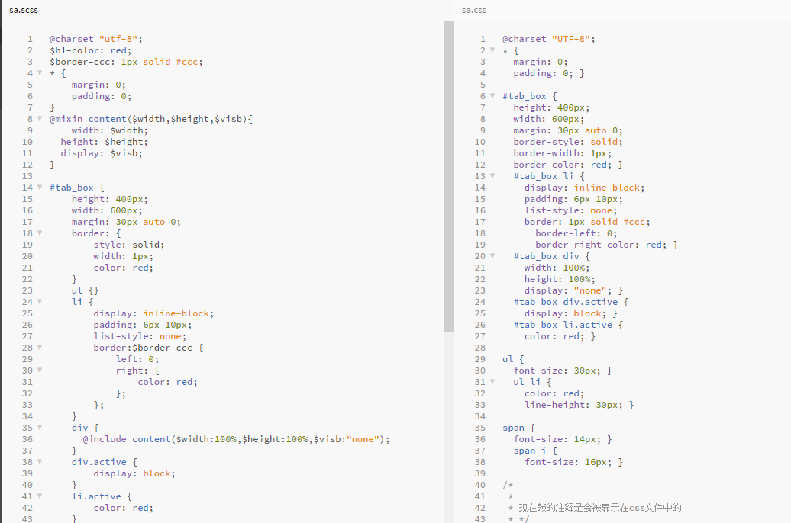
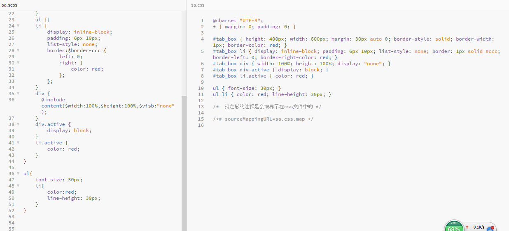
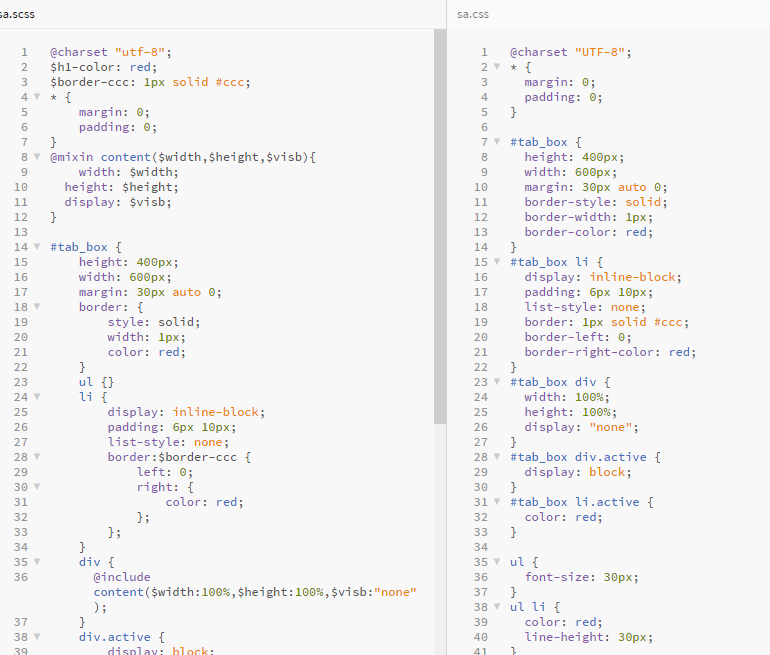

### 编译sass四种格式

> 四种格式

1. nested 嵌套格式
2. compact 紧凑格式
3. expanded 扩展格式
4. compressed 压缩格式

> 编译时默认使用的是嵌套格式

> nested 嵌套格式
1. sass --watch sa.scss:sa.css --style nested

> compact 紧凑
1. sass --watch sa.scss:sa.css --style compact

> expanded 扩展
1. sass --watch sa.scss:sa.css --style expanded

> compressed 压缩
1. sass --watch sa.scss:sa.css --style compressed

